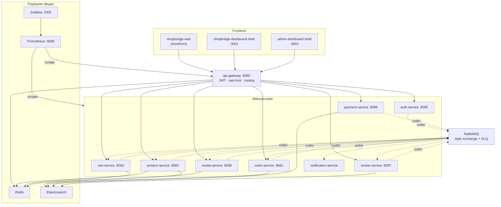

# ShopBridge — E-Ticaret Mikroservis Platformu

Olay güdümlü (event-driven) bir e-ticaret platformu: 9 Spring Boot mikroservisi, mikro-frontend mimarisiyle kurulmuş 3 React arayüzü ve paylaşılan bir altyapı katmanı. Her servis kendi veritabanına sahiptir, servisler arası iletişim RabbitMQ üzerinden **Transactional Outbox** deseniyle yürür ve tüm dış trafik tek bir API Gateway'den geçer.

| | |
|---|---|
| **Backend** | Java 17/21, Spring Boot 3.3.x & 4.1.0, Spring Cloud Gateway |
| **Frontend** | React 18, Vite, Module Federation, TanStack Query, Zustand |
| **Veri** | PostgreSQL (servis başına bir instance), Redis, Elasticsearch, MinIO |
| **Mesajlaşma** | RabbitMQ (topic exchange + DLQ), Transactional Outbox |
| **Gözlemlenebilirlik** | Micrometer → Prometheus → Grafana |
| **CI** | GitHub Actions (servis başına bağımsız pipeline), Testcontainers |

---

## İçindekiler

- [Mimari](#mimari)
- [Servisler](#servisler)
- [Mikro-frontend'ler](#mikro-frontendler)
- [Olay akışı](#olay-akışı)
- [Hızlı başlangıç](#hızlı-başlangıç)
- [Yapılandırma](#yapılandırma)
- [Gözlemlenebilirlik](#gözlemlenebilirlik)
- [Test stratejisi](#test-stratejisi)
- [CI](#ci)
- [Güvenlik](#güvenlik)
- [Depo düzeni](#depo-düzeni)
- [Sorun giderme](#sorun-giderme)

---

## Mimari



**Tasarım kararları**

- **Servis başına veritabanı.** Hiçbir servis başkasının tablosunu okumaz; tutarlılık olaylarla sağlanır.
- **Transactional Outbox.** Servisler RabbitMQ'ya doğrudan yazmaz. Önce aynı transaction içinde `outbox_event` tablosuna yazılır, ayrı bir `@Scheduled` publisher `FOR UPDATE SKIP LOCKED` ile okuyup basar. Böylece "DB commit oldu ama mesaj gitmedi" durumu oluşmaz. Teslimat *at-least-once*'tır — tüketiciler idempotent olmak zorundadır.
- **IDOR koruması.** Kaynak sahipliği (`storeId`, `userId`) istek gövdesinden değil, yalnızca JWT'den çıkarılır.
- **Hexagonal mimari.** `media-service` bunu ArchUnit ile build-time zorunlu kılar (`HexagonalArchitectureTest`): domain katmanı infrastructure'a bağımlı olamaz, use case yalnızca port'ları görür.
- **Veritabanı seviyesinde son savunma hattı.** Her serviste PL/pgSQL trigger'ları uygulama katmanını bypass eden yazmaları reddeder (bkz. [Güvenlik](#güvenlik)).

---

## Servisler

| Servis | Dizin | Host portu | Veritabanı | Boot / Java | Öne çıkan |
|---|---|---|---|---|---|
| API Gateway | `api-gateway/` | `8080` | — | 3.3.5 / 21 | Spring Cloud Gateway, Redis rate limiter, JWT doğrulama |
| Auth | `PromptEngineering/` | `8085` | `postgres_auth` `:5438` | 4.1.0 / 17 | Kayıt + OTP doğrulama + login, JWT üretimi |
| Product | `product/` | `8082` | `postgres-product` `:5437` | 4.1.0 / 17 | Katalog, Elasticsearch arama, Redis cache |
| Cart | `cart/` | `8083` | `postgres_cart` `:5436` | 4.1.0 / 17 | Sepet, Redis |
| Order | `order/` | `8081` | `ecommerce-postgres-order` `:5435` | 4.1.0 / 17 | Sipariş yaşam döngüsü, stok rezervasyonu |
| Payment | `payment/` | `8086` | `postgres-payment` `:5439` | 4.1.0 / 21 | Ödeme sağlayıcı entegrasyonu, iade |
| Review | `review/` | `8087` | `postgres-review` `:5440` | 4.1.0 / 17 | Yorum, `order.shipped` ile yorum hakkı açma |
| Media | `media-service/` | `8096` | `media-postgres` `:5445` | 3.3.5 / 21 | WebP dönüşümü (Scrimage), MinIO object storage, Flyway |
| Notification | `notification-service/` | — | `postgres-notification` `:5433` | 3.3.4 / 21 | SMTP e-posta, OTP; yalnızca olay tüketir |

> Tablodaki portlar **host** portlarıdır. Container içi portlar farklıdır (ör. `cart-service` container'da `8080`, host'ta `8083` dinler); servisler birbirine container adı ve container portu üzerinden erişir.

### Gateway rotaları

Tüm dış trafik `http://localhost:8080` üzerinden geçer:

| Yol | Hedef | Rate limit (replenish/burst) |
|---|---|---|
| `/api/v1/auth/**` | auth-service | — |
| `/api/v1/products/search` | product-service | — |
| `/api/v1/products/**` | product-service | 10 / 20 |
| `/api/v1/media/**` | media-service | 20 / 40 |
| `/api/orders/**` | order-service | 10 / 20 |
| `/api/carts/**` | cart-service | 10 / 20 |
| `/api/payments/**` | payment-service | 10 / 20 |
| `/api/reviews/**` | review-service | 10 / 20 |

Rate limit anahtarı `X-User-Id` başlığıdır; başlık yoksa istemci IP'sine düşer — böylece token gerektirmeyen public endpoint'ler de limitlenir. Media limitinin yüksek tutulmasının nedeni ürün detay ekranının token'sız galeri çağrıları yapmasıdır.

---

## Mikro-frontend'ler

Üç bağımsız uygulama, Vite Module Federation ile birleştirilir. `react`, `react-dom`, `@tanstack/react-query` ve `zustand` singleton olarak paylaşılır.

**`shopbridge-dashboard-shell`** (`:3001`) — mağaza paneli:

| Remote | Port | Dizin |
|---|---|---|
| `mfe_orders` | `5001` | `shopbridge-mfe/` |
| `mfe_cart` | `5002` | `shopbridge-mfe-cart/` |
| `mfe_payments` | `5003` | `shopbridge-mfe-payments/` |
| `mfe_reviews` | `5004` | `shopbridge-mfe-review/` |
| `mfe_products` | `5005` | `shopbridge-mfe-products/` |
| `mfe_orders_store` | `6001` | `mfe-orders/` |
| `mfe_reviews_store` | `6004` | `mfe-reviews/` |
| `mfe_products_store` | `6005` | `mfe-products/` |
| `mfe_product_create` | `6006` | `mfe-products-create/` |
| `mfe_product_detail` | `6010` | `mfe-product-detail/` |

**`admin-dashboard-shell`** (`:3002`) — yönetim paneli: `admin_mfe_orders` (`6101`), `admin_mfe_payments` (`6102`), `admin_mfe_reviews` (`6103`).

**`shopbridge-web`** — federation kullanmayan bağımsız storefront uygulaması.

Ayrıca `mfe-media-gallery/` (`6008`) galeri bileşenini sunar.

> `mfe_products` (`5005`) ile `mfe_products_store` (`6005`) aynı paketin farklı deployment'larıdır: ilki müşteri widget'ını, ikincisi `Store*` bileşenlerini expose eder. Bu yüzden ayrı remote anahtarlarıyla bağlanırlar.

---

## Olay akışı

Exchange'ler topic tipindedir ve tüketici kuyruklarının DLQ'su vardır.

**Bağlı akışlar** — üreticisi ve tüketicisi olan olaylar:

| Exchange / routing key | Üretici | Tüketici | Etki |
|---|---|---|---|
| `order.exchange` / `order.created` | order | cart → `cart.order.created.queue` | Sipariş oluşunca sepet temizlenir |
| `order.exchange` / `order.created` | order | product → `product.stock.reservation.q` | Stok rezerve edilir |
| *(stok yanıtı)* | product | order → `order.stock.response.queue` | Rezervasyon sonucu siparişe döner |
| `order.exchange` / `order.approved` | order | payment → `order.approved.queue` | Ödeme başlatılır |
| `order.exchange` / `order.shipped` | order | review → `review.order.shipped.queue` | Yorum hakkı açılır |
| `ecommerce.topic` / `catalog.event.*` | product | product → `search.catalog.sync.q` | Elasticsearch katalog indeksi güncellenir |
| *(OTP kuyruğu)* | auth | notification | OTP e-postası gönderilir |

**Yayınlanan ancak henüz tüketilmeyen olaylar** — üretici tarafı hazır, tüketici tarafı ileriye dönük:

| Exchange | Routing key | Üretici |
|---|---|---|
| `payment.exchange` | `payment.completed` · `payment.failed` · `payment.refunded` | payment |
| `media.exchange` | `media.uploaded` · `media.updated` · `media.deleted` | media |
| `review.exchange` | `review.created` | review |
| `cart.exchange` | `cart.cartupdatedevent` · `cart.cartclearedevent` | cart |
| `order.exchange` | `order.cancelled` | order |

> **`product.deleted` özel bir durumdur.** `media-service` bu olayı dinler ve ürün silindiğinde o ürünün tüm görsellerini kaskad soft-delete eder — ancak `product-service` şu an `product.exchange` üzerine **hiçbir şey yayınlamamaktadır**. Dinleyici pasif durur: kuyruk oluşur, mesaj gelmez, zararsızdır. Sözleşme yine de test edilir — `ProductDeletedListenerSubsystemTest`, product-service'in yerine geçerek gerçek bir RabbitMQ broker'ına ham AMQP istemcisiyle mesaj basar. Product tarafı bu olayı yayınlamaya başladığında entegrasyon kendiliğinden çalışır.

Tüm yayınlar outbox üzerinden yapılır: mesaj gövdesi `outbox_event.payload` içinde ham JSON string olarak saklanır ve `content-type: application/json` ile, converter'dan geçirilmeden basılır — bu, JSON'ın ikinci kez sarmalanmasını (double encoding) önler.

---

## Hızlı başlangıç

### Ön koşullar

- Docker Engine 24+ ve Docker Compose v2
- JDK 21 (tüm servisleri kaynaktan derlemek için; 17 hedefleyen servisler de 21 ile derlenir)
- Node.js 20+ (frontend geliştirmesi için)

### 1. Paylaşılan ağı oluştur

Tüm compose dosyaları `ecommerce-shared-network` ağını **external** olarak tanımlar; Docker bunu kendisi oluşturmaz:

```bash
docker network create ecommerce-shared-network
```

### 2. Altyapıyı ayağa kaldır

Diğer her şey buna bağımlıdır, **önce bu çalışmalıdır**:

```bash
cd ecommerce-infra && docker compose up -d --wait
```

Bu adım RabbitMQ, Elasticsearch, Redis, Prometheus ve Grafana'yı başlatır. `--wait`, her servisin healthcheck'i `healthy` olana kadar bekler.

`ecommerce-infra/.env` dosyası gereklidir ve depoda **yoktur** (`.gitignore`'da):

```bash
RABBITMQ_USER=admin
RABBITMQ_PASSWORD=<parola>
GRAFANA_ADMIN_USER=admin
GRAFANA_ADMIN_PASSWORD=<parola>
```

### 3. Servisleri başlat

Her servis kendi compose dosyasını ve veritabanını taşır. Bağımlılık sırası: **auth → product → cart → order → payment → review → media → notification → gateway**.

```bash
docker compose -f PromptEngineering/compose.yml     up -d --build
docker compose -f product/compose.yaml              up -d --build
docker compose -f cart/compose.yaml                 up -d --build
docker compose -f order/compose.yaml                up -d --build
docker compose -f payment/compose.yaml              up -d --build
docker compose -f review/compose.yaml               up -d --build
docker compose -f media-service/compose.yml         up -d --build
docker compose -f notification-service/compose.yaml up -d --build
docker compose -f api-gateway/docker-compose.yml    up -d --build
```

### 4. Doğrula

```bash
curl -fsS http://localhost:8080/actuator/health
```

### 5. Frontend'i çalıştır

Shell, remote'lar ayakta olmadan boş render eder — önce remote'ları başlatın:

```bash
cd shopbridge-mfe-products && npm ci && npm run build && npm run preview
```

```bash
cd shopbridge-dashboard-shell && npm ci && npm run dev
```

> Module Federation remote'ları `remoteEntry.js` üzerinden yüklenir; bu dosya yalnızca **build** çıktısında bulunur. Remote'ları `npm run dev` ile değil, `npm run build && npm run preview` ile çalıştırın.

### Tek bir servisi yerelde derlemek

```bash
cd media-service && ./mvnw clean verify
```

Testcontainers kullanan katmanlar Docker gerektirir; Docker yoksa `@EnabledIf` ile sessizce atlanır.

---

## Yapılandırma

Tüm ayarlar ortam değişkeniyle geçersiz kılınabilir; parantez içindekiler varsayılanlardır.

| Değişken | Kullanan | Varsayılan |
|---|---|---|
| `JWT_SECRET` | tüm servisler | ortak geliştirme anahtarı |
| `DB_HOST` / `DB_PORT` / `DB_NAME` / `DB_USER` / `DB_PASSWORD` | tüm veri servisleri | `localhost:5432` |
| `RABBITMQ_HOST` / `RABBITMQ_PORT` / `RABBITMQ_USER` / `RABBITMQ_PASSWORD` | mesajlaşan servisler | `localhost:5672`, `guest` |
| `REDIS_HOST` / `REDIS_PORT` / `REDIS_DATABASE` | gateway, product, cart, media | `localhost:6379` |
| `SMTP_USER` / `SMTP_PASSWORD` | notification | — (zorunlu) |
| `MINIO_*` | media | `minioadmin` |

> **`JWT_SECRET` tüm servislerde aynı olmalıdır.** Hizasızsa korumalı endpoint'ler sessizce `403` döner — token doğrulanamaz ama hata da üretilmez. Üretimde varsayılan değeri mutlaka değiştirin.

Redis veritabanı numaraları izole edilmiştir: gateway rate limiter `5`, media cache `6`.

---

## Gözlemlenebilirlik

Her servis `/actuator/prometheus` üzerinden metrik sunar; `application` etiketi servis adıyla doldurulur ve `http.server.requests` için percentile histogram açıktır (Grafana'daki `histogram_quantile()` sorguları buna bağlıdır).

| Arayüz | Adres |
|---|---|
| Prometheus | http://localhost:9090 |
| Grafana | http://localhost:3300 |
| RabbitMQ Management | http://localhost:15672 |
| MinIO Console | http://localhost:9001 |

Grafana, datasource ve dashboard'ları provisioning ile otomatik kurar — `ShopBridge` klasöründeki **ShopBridge — Servis Genel Bakış** panosu istek oranı, p95 gecikme, 5xx oranı, JVM heap, HikariCP bağlantıları ve RabbitMQ kuyruk derinliğini gösterir.

RabbitMQ metrikleri `rabbitmq_prometheus` plugin'i üzerinden `:15692` portundan toplanır.

Scrape hedefleri `ecommerce-infra/prometheus/prometheus.yml` içinde tanımlıdır. Bir servisin container adı veya portu değişirse bu dosya da güncellenmelidir — infra CI, dosyadaki her job'ın çalışan Prometheus'a gerçekten yüklendiğini doğrular.

---

## Test stratejisi

Testler, gerçek bağımlılık kullanım derecesine göre katmanlanmıştır. Katman adı paket adıdır, böylece hem çalıştırma hem de raporlama seçilebilir olur:

| Katman | Ne kullanır | Docker |
|---|---|---|
| `unit` | Saf Mockito, altyapı yok | hayır |
| `integration` | `@WebMvcTest` + gerçek Spring Security filtre zinciri | hayır |
| `module` | ArchUnit — hexagonal mimari ve SOLID sınır kuralları | hayır |
| `subsystem` | Testcontainers (Postgres, RabbitMQ, Redis, MinIO); beyaz kutu, bean'ler inject edilir | **evet** |
| `system` | Tam stack, kara kutu — yalnızca public HTTP API | **evet** |
| `alpha` | Tam stack, uçtan uca tek yolculuk senaryosu | **evet** |

En kapsamlı örnek `media-service`'tir (6 katmanın tamamı, 157 test). `subsystem` katmanı cross-service sözleşmeleri de doğrular: örneğin `product.deleted` olayı, gerçek bir RabbitMQ broker'ına bağımsız bir AMQP istemcisiyle basılarak product-service'in sözleşmesi simüle edilir.

Docker gerektiren testler `@EnabledIf("...DockerAvailability#isDockerAvailable")` ile korunur. CI bunun "yeşil ama hiçbir şey koşmamış" duruma dönüşmesini engeller: `media-ci.yml`, surefire raporlarında bu katmanların gerçekten çalıştığını (`skipped=0`, `tests>0`) ayrıca doğrular.

---

## CI

Her servisin bağımsız bir GitHub Actions pipeline'ı vardır ve yalnızca kendi dizini değiştiğinde tetiklenir:

```
.github/workflows/
├── api-gateway-ci.yml         ├── order-ci.yml
├── auth-service-ci.yml        ├── payment-ci.yml
├── cart-ci.yml                ├── product-ci.yml
├── ecommerce-infra-ci.yml     ├── review-ci.yml
├── media-ci.yml               └── notification-service-ci.yml
```

Java pipeline'ları: JDK kurulumu (Maven cache) → `mvn -B clean verify` → surefire raporları ve jar artifact olarak yüklenir.

`ecommerce-infra-ci.yml` farklıdır — Java kodu yoktur, bunun yerine altyapının gerçekten sağlıklı ayağa kalktığını doğrular:

1. `docker compose config` ile sözdizimi
2. Compose lint — her servisin healthcheck'i olmalı, hiçbir imaj kayan `:latest` etiketi kullanmamalı
3. `promtool check config` ile `prometheus.yml`, ayrıca Grafana provisioning YAML/JSON doğrulaması
4. `up -d --wait` ile tüm stack healthy olana kadar bekleme
5. Smoke testler: RabbitMQ ping + management API, Elasticsearch cluster durumu, Redis set/get, Prometheus'ta her job'ın yüklenmesi ve `rabbitmq`/`prometheus` hedeflerinin gerçekten `up` olması, Grafana'da datasource + dashboard provisioning'inin uygulanması ve Prometheus'a proxy sorgusu

Statik analiz için JetBrains Qodana yapılandırması `qodana.yaml` içindedir.

---

## Güvenlik

**Kimlik doğrulama.** Auth service kayıt → OTP doğrulama → login akışını yürütür ve JWT üretir. Gateway'deki `JwtAuthenticationGlobalFilter` token'ı doğrular, `X-User-Id` ve `X-User-Role` başlıklarını aşağı akışa geçirir ve **istemcinin gönderdiği sahte `X-User-Id`/`X-User-Role` başlıklarını ezer** — bu başlıklara yalnızca gateway'in arkasında güvenilebilir. Roller: `ROLE_CUSTOMER`, `ROLE_STORE`, `ROLE_ADMIN`.

**Yetkilendirme.** Endpoint seviyesinde `@PreAuthorize`, kaynak seviyesinde sahiplik kontrolü. Sahiplik bilgisi istekten değil yalnızca JWT'den okunur — başka bir mağazanın kaynağına erişim `403` alır.

**Veritabanı trigger'ları.** Her servis, uygulama katmanını bypass eden çağırıcılara (kompromize servis, bug, doğrudan DB erişimi) karşı son savunma hattı olarak PL/pgSQL trigger'ları tanımlar. Bunlar SQL injection filtresi **değildir** (sorgular zaten parametre binding kullanır); masum bir kullanıcının asla ihtiyaç duymayacağı işlemleri engellerler:

- `media_asset` üzerinde fiziksel `DELETE` tamamen yasak — soft delete sözleşmesi DB seviyesinde zorunlu
- `outbox_event.payload` geçerli JSON olmak zorunda
- Yayınlanmış (`processed=true`) outbox satırlarının gövdesi değiştirilemez
- Boyut/tutar alanlarında aralık ve tip değişmezleri, kimlik ve finansal alanlarda değişmezlik, geçersiz durum geçişleri

`media-service` bunları Flyway migration'ı (`V2__security_triggers.sql`) olarak taşır ve `SecurityTriggersSubsystemTest` ile gerçek Postgres üzerinde, uygulama katmanı kasıtlı olarak bypass edilerek doğrular. Diğer servislerde `db/security-triggers.sql` olarak `spring.sql.init` ile uygulanır.

**Rate limiting.** Gateway'de Redis tabanlı token bucket (bkz. [Gateway rotaları](#gateway-rotaları)).

**Yükleme güvenliği.** Media service dosya türünü hem beyan edilen `Content-Type` hem de magic byte ile doğrular; ikisi uyuşmazsa reddeder. Kabul edilen her görsel WebP'ye dönüştürülür.

---

## Depo düzeni

```
ecommerce-monorepo/
├── api-gateway/              Spring Cloud Gateway
├── PromptEngineering/        auth-service
├── product/  cart/  order/  payment/  review/
├── media-service/            WebP + MinIO
├── notification-service/     SMTP, yalnızca tüketici
├── ecommerce-infra/          RabbitMQ · Elasticsearch · Redis · Prometheus · Grafana
│   ├── compose.yml
│   ├── prometheus/prometheus.yml
│   ├── grafana/provisioning/
│   └── rabbitmq/enabled_plugins
├── shopbridge-web/                  storefront (federation yok)
├── shopbridge-dashboard-shell/      mağaza paneli shell'i
├── admin-dashboard-shell/           yönetim paneli shell'i
├── shopbridge-mfe*/  mfe-*/  admin-mfe-*/    federation remote'ları
├── .github/workflows/        servis başına CI
└── qodana.yaml
```

Her Java servisi kendi içinde katmanlıdır: `api` (controller + DTO) · `application` (use case + port) · `domain` (model + iş kuralları) · `infrastructure` (adapter: persistence, messaging, security, storage).

---

## Sorun giderme

**`network ecommerce-shared-network not found`** — Paylaşılan ağ external tanımlıdır. `docker network create ecommerce-shared-network` çalıştırın.

**Korumalı endpoint'ler sessizce `403` dönüyor** — `JWT_SECRET` servisler arasında hizasız. Tüm servislerde aynı değeri kullanın.

**Frontend boş render ediyor, konsolda `remoteEntry.js` 404** — Remote'lar `npm run dev` ile çalıştırılmış. `remoteEntry.js` yalnızca build çıktısında üretilir; `npm run build && npm run preview` kullanın.

**Elasticsearch `--wait` sırasında zaman aşımına uğruyor** — `start_period` 60 saniyedir ve ilk açılış yavaştır. `docker compose logs elasticsearch` ile bellek limitini kontrol edin (`ES_JAVA_OPTS=-Xms1g -Xmx1g`).

**Testcontainers "Could not find a valid Docker environment"** — Docker Desktop'ın yeni sürümlerinde `npipe` üzerinden API sürüm uyuşmazlığı olabilir. Docker çalışıyorsa `DOCKER_HOST` ayarını veya Testcontainers sürümünü kontrol edin.

**Prometheus'ta hedefler `DOWN`** — `prometheus.yml` hedefleri container adı ve **container içi** port kullanır, host portu değil. Servis `ecommerce-shared-network` üzerinde mi kontrol edin.
