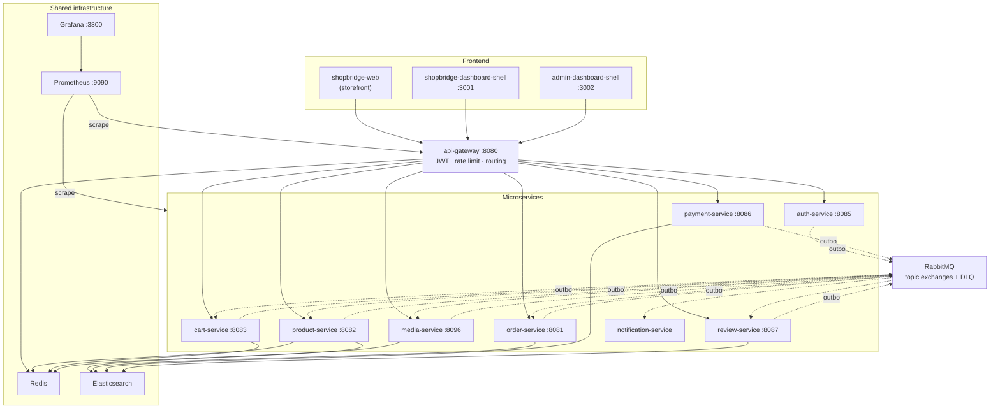

# ShopBridge — E-Commerce Microservice Platform

An event-driven e-commerce platform: 9 Spring Boot microservices, 3 React frontends built on a micro-frontend architecture, and a shared infrastructure layer. Every service owns its database, inter-service communication runs over RabbitMQ using the **Transactional Outbox** pattern, and all external traffic passes through a single API Gateway.

| | |
|---|---|
| **Backend** | Java 17/21, Spring Boot 3.3.x & 4.1.0, Spring Cloud Gateway |
| **Frontend** | React 18, Vite, Module Federation, TanStack Query, Zustand |
| **Data** | PostgreSQL (one instance per service), Redis, Elasticsearch, MinIO |
| **Messaging** | RabbitMQ (topic exchanges + DLQ), Transactional Outbox |
| **Observability** | Micrometer → Prometheus → Grafana |
| **CI** | GitHub Actions (independent pipeline per service), Testcontainers |

---

## Table of contents

- [Architecture](#architecture)
- [Services](#services)
- [Micro-frontends](#micro-frontends)
- [Event flow](#event-flow)
- [Quick start](#quick-start)
- [Configuration](#configuration)
- [Observability](#observability)
- [Testing strategy](#testing-strategy)
- [CI](#ci)
- [Security](#security)
- [Repository layout](#repository-layout)
- [Troubleshooting](#troubleshooting)

---

## Architecture



**Design decisions**

- **Database per service.** No service reads another's tables; consistency is achieved through events.
- **Transactional Outbox.** Services never publish to RabbitMQ directly. A row is written to `outbox_event` inside the same transaction, and a separate `@Scheduled` publisher reads it with `FOR UPDATE SKIP LOCKED` and dispatches it. This eliminates the "DB committed but the message was never sent" failure mode. Delivery is *at-least-once* — consumers must be idempotent.
- **IDOR protection.** Resource ownership (`storeId`, `userId`) is never taken from the request body — it is derived exclusively from the JWT.
- **Hexagonal architecture.** `media-service` enforces this at build time with ArchUnit (`HexagonalArchitectureTest`): the domain layer cannot depend on infrastructure, and use cases only see ports.
- **Last line of defense at the database level.** Every service defines PL/pgSQL triggers that reject writes bypassing the application layer (see [Security](#security)).

---

## Services

| Service | Directory | Host port | Database | Boot / Java | Highlights |
|---|---|---|---|---|---|
| API Gateway | `api-gateway/` | `8080` | — | 3.3.5 / 21 | Spring Cloud Gateway, Redis rate limiter, JWT validation |
| Auth | `PromptEngineering/` | `8085` | `postgres_auth` `:5438` | 4.1.0 / 17 | Register + OTP verification + login, JWT issuing |
| Product | `product/` | `8082` | `postgres-product` `:5437` | 4.1.0 / 17 | Catalog, Elasticsearch search, Redis cache |
| Cart | `cart/` | `8083` | `postgres_cart` `:5436` | 4.1.0 / 17 | Shopping cart, Redis |
| Order | `order/` | `8081` | `ecommerce-postgres-order` `:5435` | 4.1.0 / 17 | Order lifecycle, stock reservation |
| Payment | `payment/` | `8086` | `postgres-payment` `:5439` | 4.1.0 / 21 | Payment provider integration, refunds |
| Review | `review/` | `8087` | `postgres-review` `:5440` | 4.1.0 / 17 | Reviews, unlocked by `order.shipped` |
| Media | `media-service/` | `8096` | `media-postgres` `:5445` | 3.3.5 / 21 | WebP conversion (Scrimage), MinIO object storage, Flyway |
| Notification | `notification-service/` | — | `postgres-notification` `:5433` | 3.3.4 / 21 | SMTP email, OTP; consumer only |

> Ports in the table are **host** ports. Container-internal ports differ (e.g. `cart-service` listens on `8080` inside the container and `8083` on the host); services reach each other by container name and container port.

### Gateway routes

All external traffic goes through `http://localhost:8080`:

| Path | Target | Rate limit (replenish/burst) |
|---|---|---|
| `/api/v1/auth/**` | auth-service | — |
| `/api/v1/products/search` | product-service | — |
| `/api/v1/products/**` | product-service | 10 / 20 |
| `/api/v1/media/**` | media-service | 20 / 40 |
| `/api/orders/**` | order-service | 10 / 20 |
| `/api/carts/**` | cart-service | 10 / 20 |
| `/api/payments/**` | payment-service | 10 / 20 |
| `/api/reviews/**` | review-service | 10 / 20 |

The rate limit key is the `X-User-Id` header; when absent it falls back to the client IP, so endpoints that require no token are rate limited too. The media limit is higher because the product detail screen issues token-less gallery calls.

---

## Micro-frontends

Three independent applications composed via Vite Module Federation. `react`, `react-dom`, `@tanstack/react-query` and `zustand` are shared as singletons.

**`shopbridge-dashboard-shell`** (`:3001`) — store dashboard:

| Remote | Port | Directory |
|---|---|---|
| `mfe_orders` | `5001` | `shopbridge-mfe/` |
| `mfe_cart` | `5002` | `shopbridge-mfe-cart/` |
| `mfe_payments` | `5003` | `shopbridge-mfe-payments/` |
| `mfe_reviews` | `5004` | `shopbridge-mfe-review/` |
| `mfe_products` | `5005` | `shopbridge-mfe-products/` |
| `mfe_orders_store` | `6001` | `mfe-orders/` |
| `mfe_reviews_store` | `6004` | `mfe-reviews/` |
| `mfe_products_store` | `6005` | `mfe-products/` |
| `mfe_product_create` | `6006` | `mfe-products-create/` |
| `mfe_product_detail` | `6010` | `mfe-product-detail/` |

**`admin-dashboard-shell`** (`:3002`) — admin dashboard: `admin_mfe_orders` (`6101`), `admin_mfe_payments` (`6102`), `admin_mfe_reviews` (`6103`).

**`shopbridge-web`** — standalone storefront application, no federation.

`mfe-media-gallery/` (`6008`) additionally exposes the gallery component.

> `mfe_products` (`5005`) and `mfe_products_store` (`6005`) are two deployments of the same package: the first exposes the customer widget, the second exposes the `Store*` components. That is why they are wired under separate remote keys.

---

## Event flow

Exchanges are topic-typed and consumer queues have dead-letter queues.

**Wired flows** — events that have both a producer and a consumer:

| Exchange / routing key | Producer | Consumer | Effect |
|---|---|---|---|
| `order.exchange` / `order.created` | order | cart → `cart.order.created.queue` | Cart is cleared once the order is placed |
| `order.exchange` / `order.created` | order | product → `product.stock.reservation.q` | Stock is reserved |
| *(stock response)* | product | order → `order.stock.response.queue` | Reservation result returns to the order |
| `order.exchange` / `order.approved` | order | payment → `order.approved.queue` | Payment is initiated |
| `order.exchange` / `order.shipped` | order | review → `review.order.shipped.queue` | Review eligibility is unlocked |
| `ecommerce.topic` / `catalog.event.*` | product | product → `search.catalog.sync.q` | Elasticsearch catalog index is updated |
| *(OTP queue)* | auth | notification | OTP email is sent |

**Published but not yet consumed** — the producer side is ready, the consumer side is future work:

| Exchange | Routing key | Producer |
|---|---|---|
| `payment.exchange` | `payment.completed` · `payment.failed` · `payment.refunded` | payment |
| `media.exchange` | `media.uploaded` · `media.updated` · `media.deleted` | media |
| `review.exchange` | `review.created` | review |
| `cart.exchange` | `cart.cartupdatedevent` · `cart.cartclearedevent` | cart |
| `order.exchange` | `order.cancelled` | order |

> **`product.deleted` is a special case.** `media-service` listens for this event and cascade soft-deletes all images of a deleted product — but `product-service` currently publishes **nothing** on `product.exchange`. The listener stays passive: the queue is created, no message arrives, and it is harmless. The contract is still tested — `ProductDeletedListenerSubsystemTest` stands in for product-service and publishes to a real RabbitMQ broker with a raw AMQP client. The integration will work as soon as the product side starts publishing.

All publishing goes through the outbox: the message body is stored as a raw JSON string in `outbox_event.payload` and dispatched with `content-type: application/json` without passing through a message converter — this prevents the JSON from being wrapped a second time (double encoding).

---

## Quick start

### Prerequisites

- Docker Engine 24+ and Docker Compose v2
- JDK 21 (to build every service from source; the ones targeting 17 also compile under 21)
- Node.js 20+ (for frontend development)

### 1. Create the shared network

Every compose file declares `ecommerce-shared-network` as **external**; Docker will not create it for you:

```bash
docker network create ecommerce-shared-network
```

### 2. Bring up the infrastructure

Everything else depends on it, so this **must run first**:

```bash
cd ecommerce-infra && docker compose up -d --wait
```

This starts RabbitMQ, Elasticsearch, Redis, Prometheus and Grafana. `--wait` blocks until every service reports a `healthy` healthcheck.

`ecommerce-infra/.env` is required and is **not** in the repository (it is gitignored):

```bash
RABBITMQ_USER=admin
RABBITMQ_PASSWORD=<password>
GRAFANA_ADMIN_USER=admin
GRAFANA_ADMIN_PASSWORD=<password>
```

### 3. Start the services

Each service carries its own compose file and database. Dependency order: **auth → product → cart → order → payment → review → media → notification → gateway**.

```bash
docker compose -f PromptEngineering/compose.yml     up -d --build
docker compose -f product/compose.yaml              up -d --build
docker compose -f cart/compose.yaml                 up -d --build
docker compose -f order/compose.yaml                up -d --build
docker compose -f payment/compose.yaml              up -d --build
docker compose -f review/compose.yaml               up -d --build
docker compose -f media-service/compose.yml         up -d --build
docker compose -f notification-service/compose.yaml up -d --build
docker compose -f api-gateway/docker-compose.yml    up -d --build
```

### 4. Verify

```bash
curl -fsS http://localhost:8080/actuator/health
```

### 5. Run the frontend

The shell renders empty unless its remotes are up, so start the remotes first:

```bash
cd shopbridge-mfe-products && npm ci && npm run build && npm run preview
```

```bash
cd shopbridge-dashboard-shell && npm ci && npm run dev
```

> Module Federation remotes are loaded through `remoteEntry.js`, and that file only exists in the **build** output. Run remotes with `npm run build && npm run preview`, not `npm run dev`.

### Building a single service locally

```bash
cd media-service && ./mvnw clean verify
```

Layers that use Testcontainers require Docker; without it they are silently skipped via `@EnabledIf`.

---

## Configuration

Everything can be overridden with environment variables; defaults are shown below.

| Variable | Used by | Default |
|---|---|---|
| `JWT_SECRET` | all services | shared development key |
| `DB_HOST` / `DB_PORT` / `DB_NAME` / `DB_USER` / `DB_PASSWORD` | all data services | `localhost:5432` |
| `RABBITMQ_HOST` / `RABBITMQ_PORT` / `RABBITMQ_USER` / `RABBITMQ_PASSWORD` | messaging services | `localhost:5672`, `guest` |
| `REDIS_HOST` / `REDIS_PORT` / `REDIS_DATABASE` | gateway, product, cart, media | `localhost:6379` |
| `SMTP_USER` / `SMTP_PASSWORD` | notification | — (required) |
| `MINIO_*` | media | `minioadmin` |

> **`JWT_SECRET` must be identical across all services.** If it drifts, protected endpoints silently return `403` — the token cannot be validated, but no error is surfaced either. Always replace the default in production.

Redis database numbers are isolated: `5` for the gateway rate limiter, `6` for the media cache.

---

## Observability

Every service exposes metrics at `/actuator/prometheus`, tagged with `application` set to the service name, with percentile histograms enabled for `http.server.requests` (the `histogram_quantile()` queries in Grafana depend on this).

| Interface | Address |
|---|---|
| Prometheus | http://localhost:9090 |
| Grafana | http://localhost:3300 |
| RabbitMQ Management | http://localhost:15672 |
| MinIO Console | http://localhost:9001 |

Grafana provisions its datasource and dashboards automatically — the **ShopBridge — Service Overview** dashboard in the `ShopBridge` folder shows request rate, p95 latency, 5xx rate, JVM heap, HikariCP connections and RabbitMQ queue depth.

RabbitMQ metrics are scraped from port `:15692` via the `rabbitmq_prometheus` plugin.

Scrape targets are defined in `ecommerce-infra/prometheus/prometheus.yml`. If a service's container name or port changes, that file must be updated too — the infra CI verifies that every job in the file is actually loaded by the running Prometheus.

---

## Testing strategy

Tests are layered by how much real infrastructure they exercise. The layer name is the package name, which makes both execution and reporting selectable:

| Layer | What it uses | Docker |
|---|---|---|
| `unit` | Pure Mockito, no infrastructure | no |
| `integration` | `@WebMvcTest` + the real Spring Security filter chain | no |
| `module` | ArchUnit — hexagonal architecture and SOLID boundary rules | no |
| `subsystem` | Testcontainers (Postgres, RabbitMQ, Redis, MinIO); white box, beans are injected | **yes** |
| `system` | Full stack, black box — public HTTP API only | **yes** |
| `alpha` | Full stack, a single end-to-end journey scenario | **yes** |

The most complete example is `media-service` (all six layers, 157 tests). The `subsystem` layer also verifies cross-service contracts: the `product.deleted` event, for instance, is published to a real RabbitMQ broker by an independent AMQP client that simulates product-service's contract.

Docker-dependent tests are guarded by `@EnabledIf("...DockerAvailability#isDockerAvailable")`. CI prevents this from degrading into "green but nothing ran": `media-ci.yml` additionally asserts from the surefire reports that those layers really executed (`skipped=0`, `tests>0`).

---

## CI

Each service has an independent GitHub Actions pipeline, triggered only when its own directory changes:

```
.github/workflows/
├── api-gateway-ci.yml         ├── order-ci.yml
├── auth-service-ci.yml        ├── payment-ci.yml
├── cart-ci.yml                ├── product-ci.yml
├── ecommerce-infra-ci.yml     ├── review-ci.yml
├── media-ci.yml               └── notification-service-ci.yml
```

Java pipelines: set up JDK (with Maven cache) → `mvn -B clean verify` → upload surefire reports and the jar as artifacts.

`ecommerce-infra-ci.yml` is different — there is no Java code, so it verifies that the infrastructure actually comes up healthy:

1. Syntax via `docker compose config`
2. Compose lint — every service must define a healthcheck, and no image may use a drifting `:latest` tag
3. `prometheus.yml` via `promtool check config`, plus Grafana provisioning YAML/JSON validation
4. `up -d --wait` until the whole stack is healthy
5. Smoke tests: RabbitMQ ping + management API, Elasticsearch cluster status, Redis set/get, every Prometheus job being loaded and the `rabbitmq`/`prometheus` targets actually reporting `up`, Grafana datasource + dashboard provisioning being applied, and a proxied query to Prometheus

JetBrains Qodana static analysis is configured in `qodana.yaml`.

---

## Security

**Authentication.** The auth service handles register → OTP verification → login and issues JWTs. The gateway's `JwtAuthenticationGlobalFilter` validates the token, propagates `X-User-Id` and `X-User-Role` downstream, and **overwrites any spoofed `X-User-Id`/`X-User-Role` headers sent by the client** — these headers are only trustworthy behind the gateway. Roles: `ROLE_CUSTOMER`, `ROLE_STORE`, `ROLE_ADMIN`.

**Authorization.** `@PreAuthorize` at the endpoint level, ownership checks at the resource level. Ownership is read exclusively from the JWT, never from the request — accessing another store's resource yields `403`.

**Database triggers.** Every service defines PL/pgSQL triggers as a last line of defense against callers that bypass the application layer (a compromised service, a bug, direct DB access). These are **not** a SQL injection filter (queries already use parameter binding); they block operations an innocent user would never need:

- Physical `DELETE` on `media_asset` is forbidden outright — the soft-delete contract is enforced at the DB level
- `outbox_event.payload` must be valid JSON
- The body of a published (`processed=true`) outbox row cannot be modified
- Range and type invariants on size/amount fields, immutability of identity and financial fields, and rejection of invalid state transitions

`media-service` ships these as a Flyway migration (`V2__security_triggers.sql`) and verifies them in `SecurityTriggersSubsystemTest` against a real Postgres, deliberately bypassing the application layer. Other services apply them as `db/security-triggers.sql` through `spring.sql.init`.

**Rate limiting.** Redis-backed token bucket at the gateway (see [Gateway routes](#gateway-routes)).

**Upload safety.** The media service validates file type against both the declared `Content-Type` and the file's magic bytes, rejecting any mismatch. Every accepted image is converted to WebP.

---

## Repository layout

```
ecommerce-monorepo/
├── api-gateway/              Spring Cloud Gateway
├── PromptEngineering/        auth-service
├── product/  cart/  order/  payment/  review/
├── media-service/            WebP + MinIO
├── notification-service/     SMTP, consumer only
├── ecommerce-infra/          RabbitMQ · Elasticsearch · Redis · Prometheus · Grafana
│   ├── compose.yml
│   ├── prometheus/prometheus.yml
│   ├── grafana/provisioning/
│   └── rabbitmq/enabled_plugins
├── shopbridge-web/                  storefront (no federation)
├── shopbridge-dashboard-shell/      store dashboard shell
├── admin-dashboard-shell/           admin dashboard shell
├── shopbridge-mfe*/  mfe-*/  admin-mfe-*/    federation remotes
├── .github/workflows/        CI per service
└── qodana.yaml
```

Each Java service is internally layered: `api` (controllers + DTOs) · `application` (use cases + ports) · `domain` (model + business rules) · `infrastructure` (adapters: persistence, messaging, security, storage).

---

## Troubleshooting

**`network ecommerce-shared-network not found`** — The shared network is declared external. Run `docker network create ecommerce-shared-network`.

**Protected endpoints silently return `403`** — `JWT_SECRET` has drifted between services. Use the same value everywhere.

**Frontend renders empty, console shows `remoteEntry.js` 404** — The remotes were started with `npm run dev`. `remoteEntry.js` is only produced in the build output; use `npm run build && npm run preview`.

**Elasticsearch times out during `--wait`** — `start_period` is 60 seconds and the first boot is slow. Check the memory limit with `docker compose logs elasticsearch` (`ES_JAVA_OPTS=-Xms1g -Xmx1g`).

**Testcontainers reports "Could not find a valid Docker environment"** — Recent Docker Desktop versions can hit an API version mismatch over `npipe`. If Docker is running, check your `DOCKER_HOST` setting or the Testcontainers version.

**Prometheus targets are `DOWN`** — Targets in `prometheus.yml` use container names and **container-internal** ports, not host ports. Verify the service is attached to `ecommerce-shared-network`.
